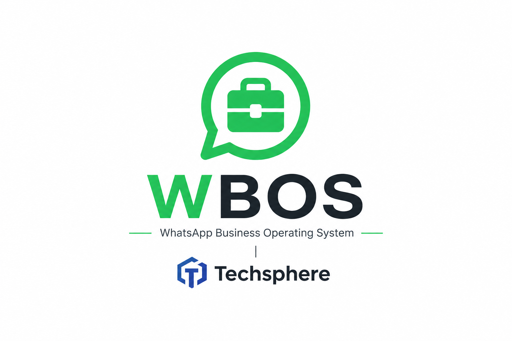
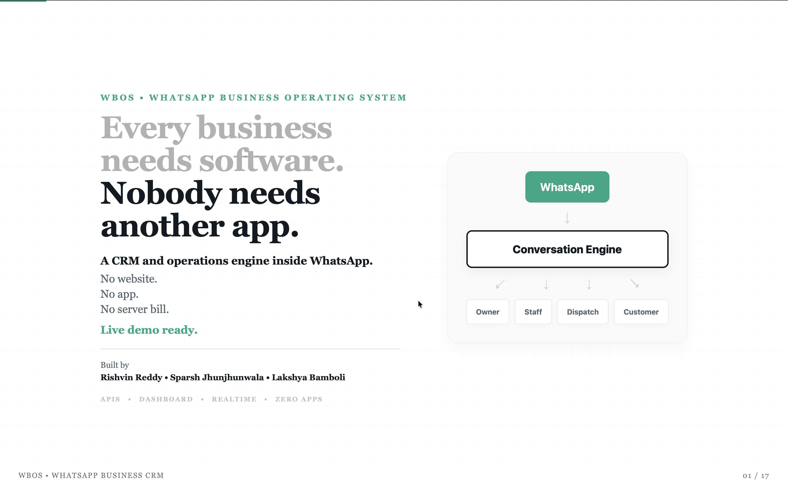
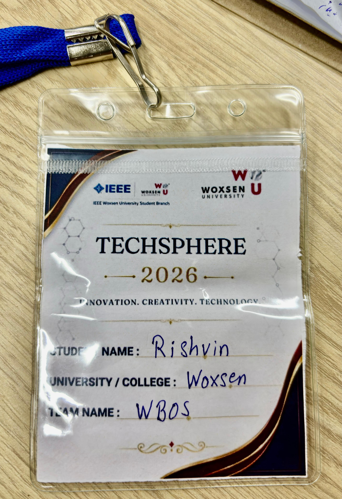
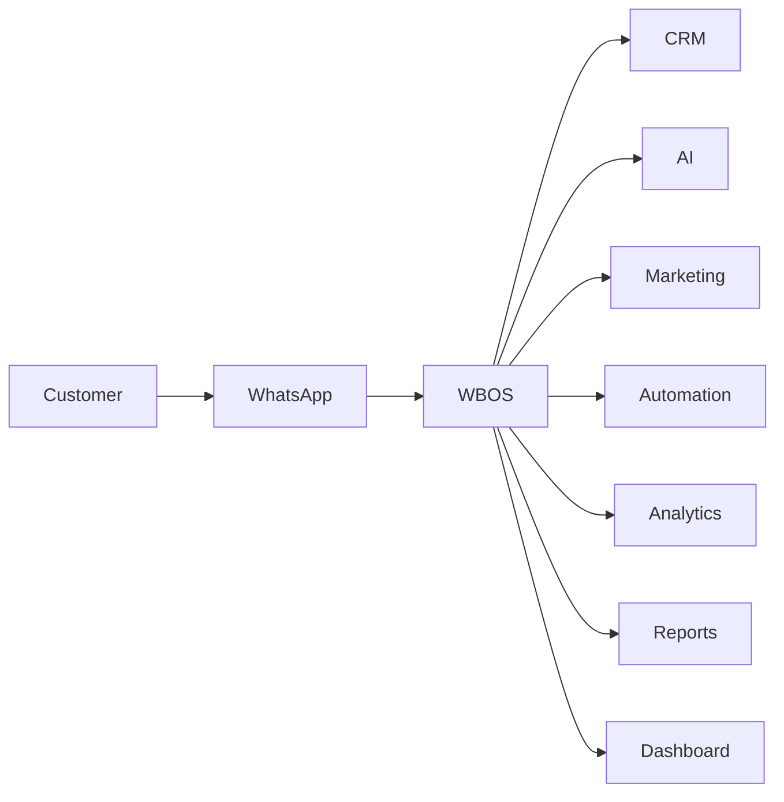
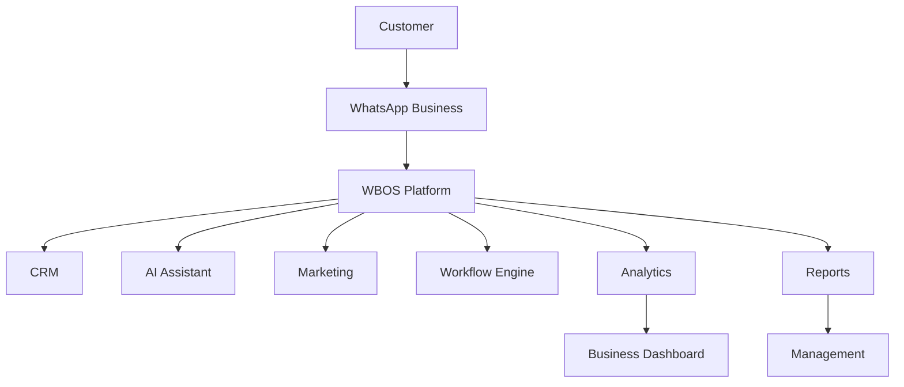
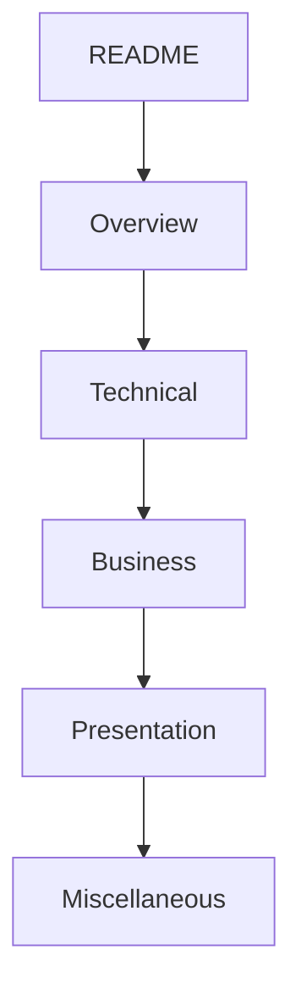
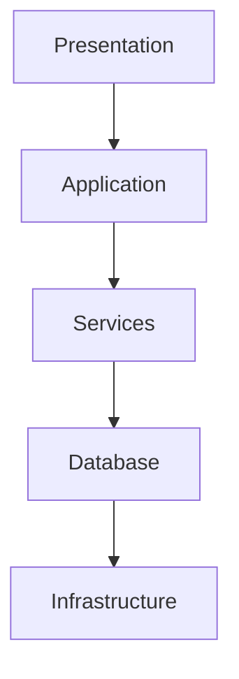
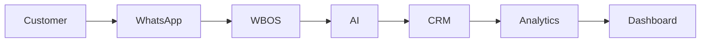
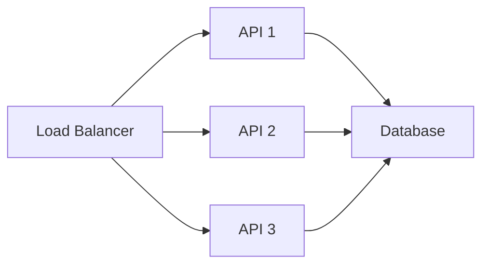

<!-- ========================================================= -->
<!--                     WBOS README                           -->
<!-- ========================================================= -->

<p align="center">

# WBOS

### WhatsApp Business Operating System

### Transforming WhatsApp into an AI-Powered Business Operating Platform

**Presented at TechSphere 2026 • Woxsen University**

---

*A next-generation Business Operating System that combines Customer Relationship Management, Artificial Intelligence, Workflow Automation, Business Intelligence, Marketing Automation, and WhatsApp Communication into one intelligent platform.*

</p>

---

<p align="center">


</p>

---

## 📸 Event Gallery

Below are some captures and highlights from the TechSphere 2026 event:

<div align="center">
  
  <br>
  
  <br>
  
  
</div>

---

## 🌐 Live Presentation

> [Live Presentation](https://rishvinreddy.github.io/TechSphere-2026-WBOS-Presentation/)

---

## 📖 Documentation

Complete documentation is available inside the **docs/** directory.

- Overview
- Technical Documentation
- Business Documentation
- Presentation Guide
- Miscellaneous Resources

---

# 🚀 Executive Summary

WBOS (**WhatsApp Business Operating System**) is an AI-powered platform designed to transform WhatsApp into a comprehensive business operating system.

Today's businesses increasingly rely on WhatsApp as their primary communication channel. While the platform is effective for customer interaction, organizations often struggle with fragmented customer information, manual workflows, disconnected software systems, and limited business insights.

WBOS addresses these challenges by integrating multiple business functions into one intelligent platform.

Instead of managing separate tools for customer relationship management, marketing, communication, reporting, analytics, and workflow automation, businesses can manage everything through a unified dashboard.

The platform combines modern web technologies, artificial intelligence, workflow automation, and business intelligence to provide organizations with a scalable, efficient, and future-ready solution.

Rather than functioning as another CRM, WBOS represents a new category of software—a **Business Operating System**—where communication, data, automation, and AI work together seamlessly.

---

# 🌍 Vision

Our vision is to build an intelligent Business Operating System that enables organizations to communicate, automate, analyze, and grow through a single unified platform.

We envision a future where businesses no longer manage isolated applications for communication, sales, marketing, analytics, and customer management. Instead, every operational process becomes interconnected through intelligent automation and artificial intelligence.

WBOS aims to redefine how organizations interact with customers by transforming conversations into actionable business intelligence.

The long-term objective is to create an ecosystem where business decisions are supported by AI, repetitive operations are automated, and customer experiences continuously improve through data-driven insights.

---

# 🎯 Mission

The mission of WBOS is to simplify business operations while empowering organizations to build stronger customer relationships.

We seek to eliminate repetitive manual work, reduce operational complexity, improve decision-making, and enable businesses to focus on what truly matters—creating value for their customers.

By combining communication, customer relationship management, automation, analytics, and artificial intelligence into a single platform, WBOS enables businesses to operate more efficiently while preparing them for the future of digital transformation.

---

# 💡 Why WBOS?

Businesses today face several operational challenges.

Customer information is often distributed across multiple applications.

Sales teams maintain spreadsheets.

Marketing teams use separate campaign tools.

Customer support relies on messaging applications.

Managers depend on manual reports.

This fragmented approach leads to:

- Duplicate work
- Lost customer information
- Delayed responses
- Poor collaboration
- Limited business visibility
- Increased operational costs

WBOS eliminates these challenges by serving as a centralized operating system where every business activity is connected.

Every customer interaction contributes to business intelligence.

Every message becomes structured data.

Every workflow can be automated.

Every department operates using the same source of truth.

---

# ✨ Key Highlights

WBOS combines multiple business capabilities into one intelligent platform.

## Customer Relationship Management

Manage complete customer profiles with conversation history, notes, purchase records, lead status, and activity timelines.

---

## WhatsApp Business Integration

Communicate with customers through one of the world's most widely used messaging platforms while maintaining centralized records.

---

## Artificial Intelligence

Leverage AI to:

- Generate smart replies
- Summarize conversations
- Analyze customer sentiment
- Qualify leads
- Generate marketing content
- Provide business recommendations

---

## Workflow Automation

Reduce repetitive manual work through automated business processes.

Examples include:

- Follow-up reminders
- Lead assignment
- Campaign scheduling
- Customer notifications
- AI-powered workflows

---

## Marketing

Create and manage marketing campaigns through intelligent customer segmentation and personalized messaging.

---

## Analytics

Transform operational data into business intelligence through real-time dashboards and detailed reports.

---

## Business Intelligence

Support executive decision-making through KPIs, predictive insights, performance tracking, and comprehensive reporting.

---

# 🏗️ Project Philosophy

WBOS was developed around five core principles.

## 1. Simplicity

Technology should reduce complexity rather than introduce it.

Every feature within WBOS has been designed to simplify business operations.

---

## 2. Intelligence

Artificial Intelligence should enhance human productivity rather than replace human decision-making.

WBOS positions AI as an intelligent business assistant capable of improving communication, automation, and strategic planning.

---

## 3. Scalability

The platform has been designed using modular architecture to ensure future expansion without requiring significant redesign.

New modules can be added independently while maintaining compatibility with the existing ecosystem.

---

## 4. User-Centered Design

Every workflow begins with understanding user needs.

The platform prioritizes intuitive navigation, minimal learning curves, and efficient task completion.

---

## 5. Business Value

Every feature must provide measurable business impact.

Examples include:

- Improved customer satisfaction
- Increased productivity
- Better analytics
- Reduced operational costs
- Faster response times
- Higher lead conversion

---

# 📚 Table of Contents

- Executive Summary
- Vision
- Mission
- Why WBOS?
- Key Highlights
- Project Philosophy

---

# 🚨 Problem Statement

## The Modern Business Challenge

Communication has become the foundation of every successful business. Whether a company sells products, provides services, or offers customer support, every customer journey begins with a conversation.

Today, **WhatsApp** has become one of the world's most widely adopted communication platforms. Millions of businesses use WhatsApp every day to answer customer inquiries, close sales, provide support, schedule appointments, and maintain long-term customer relationships.

Despite its popularity, WhatsApp was never designed to function as a complete business operating platform.

As organizations grow, they begin to experience significant operational challenges that reduce productivity, limit scalability, and negatively impact customer experience.

---

# Current Business Landscape

Most businesses rely on multiple disconnected software systems.

For example:

| Business Activity | Typical Tool |
|-------------------|--------------|
| Customer Communication | WhatsApp |
| Customer Database | Excel / CRM |
| Marketing | Email Platform |
| Reports | Excel |
| Tasks | Trello / Notion |
| Automation | Manual |
| Analytics | Google Sheets |

Although each application performs its own function effectively, these systems rarely communicate with one another.

The result is fragmented information, duplicated work, delayed communication, and poor visibility into business operations.

---

# Major Challenges

## 1. Fragmented Customer Information

Customer data often exists in multiple locations.

Examples include:

- WhatsApp Chats
- Emails
- Excel Sheets
- CRM Software
- Personal Notes
- Google Sheets

Because information is scattered, employees struggle to obtain a complete understanding of each customer.

This leads to:

- Lost information
- Duplicate records
- Poor customer experience
- Miscommunication

---

## 2. Manual Business Operations

Many business activities remain completely manual.

Examples include:

- Sending follow-up messages
- Updating spreadsheets
- Assigning leads
- Creating reminders
- Sending quotations
- Tracking customer status

These repetitive tasks consume valuable employee time.

---

## 3. Lack of Automation

Without automation:

Employees must remember to:

- Contact customers
- Send reminders
- Assign work
- Update records
- Notify managers
- Schedule meetings

As business volume increases, manual processes become increasingly difficult to manage.

---

## 4. Poor Customer Visibility

Businesses often cannot answer simple questions such as:

- Which customers are inactive?
- Which leads are likely to convert?
- Who requires follow-up today?
- Which campaign generated this customer?
- Which employee owns this customer?

Without centralized information, decision-making becomes reactive rather than proactive.

---

## 5. Limited Business Intelligence

Managers need answers to questions such as:

- How many customers were acquired this month?
- What is our average response time?
- Which campaigns generated revenue?
- Which sales representative performs best?
- What percentage of leads converted?

Traditional messaging applications cannot provide these insights.

---

## 6. Growing Operational Complexity

As businesses expand:

Customer count increases.

Employees increase.

Messages increase.

Sales increase.

Marketing campaigns increase.

Without a centralized operating system, complexity grows exponentially.

---

# Why Existing Solutions Are Not Enough

Many organizations already use CRM software.

Others use project management tools.

Some rely entirely on spreadsheets.

Each solution solves only one part of the problem.

Examples:

CRM manages customers.

Email software manages newsletters.

WhatsApp manages communication.

Analytics software generates reports.

Automation software builds workflows.

Businesses are forced to purchase, configure, integrate, and maintain multiple independent platforms.

This increases:

- Cost
- Complexity
- Training requirements
- Maintenance effort

---

# Our Solution

WBOS introduces a different approach.

Instead of managing multiple disconnected applications, businesses operate through one intelligent platform.

WBOS combines:

- Customer Relationship Management
- WhatsApp Communication
- Artificial Intelligence
- Workflow Automation
- Business Analytics
- Marketing
- Reporting

into a single ecosystem.

---

# The WBOS Approach



Every customer interaction becomes structured business information.

Every workflow becomes automatable.

Every department works from the same data.

---

# Business Objectives

WBOS aims to help organizations:

- Improve customer communication
- Increase operational efficiency
- Reduce manual work
- Automate repetitive tasks
- Generate business insights
- Improve customer satisfaction
- Increase sales conversion
- Support digital transformation

---

# Key Differentiators

Unlike traditional CRM platforms, WBOS is designed as a **Business Operating System**.

Core differentiators include:

- AI-First Architecture
- WhatsApp-Centric Communication
- Unified Dashboard
- Workflow Automation
- Modular Design
- Real-Time Analytics
- Cloud-Native Deployment
- API-First Development

---

# Business Impact

Organizations implementing WBOS can expect:

### Operational Benefits

- Faster response times
- Reduced manual effort
- Improved collaboration
- Better organization

---

### Customer Benefits

- Personalized communication
- Faster issue resolution
- Consistent customer experience
- Improved engagement

---

### Management Benefits

- Executive dashboards
- Data-driven decisions
- Performance tracking
- Business forecasting

---

# High-Level Solution Architecture



---

# What Makes WBOS Different?

WBOS is not just another CRM.

It is not simply a messaging platform.

It is not only an AI assistant.

It is not just a workflow automation tool.

Instead, WBOS unifies these capabilities into one intelligent platform where communication, operations, analytics, and automation work together seamlessly.

---

# 🌟 Complete Feature Overview

WBOS is organized into several integrated modules.

## Core Modules

- 📊 Business Dashboard
- 👥 Customer Relationship Management (CRM)
- 💬 WhatsApp Communication
- 🤖 AI Assistant
- 📣 Marketing Automation
- 🔄 Workflow Automation
- 📈 Business Analytics
- 📑 Reporting
- ✅ Task Management
- 🔔 Notifications
- 👨💼 User Management
- 🔒 Security & Authentication
- ⚙️ System Administration

Each module is documented in detail within the `/docs` directory.

---

# 🛠 Technology Stack Overview

| Layer | Technology |
|--------|------------|
| Frontend | HTML5, CSS3, JavaScript |
| Styling | Tailwind CSS |
| Backend | Node.js + Express.js |
| Database | PostgreSQL |
| ORM | Prisma ORM |
| Authentication | Clerk / JWT |
| AI | OpenAI API |
| Messaging | WhatsApp Business API |
| Automation | n8n |
| Deployment | Vercel |
| Version Control | Git & GitHub |
| Documentation | Markdown |
| Monitoring | Vercel Analytics |

For complete technical documentation, see:

> **docs/02-Technical/TECH_STACK.md**

---

# 🏛 System Architecture

WBOS follows a modular, layered architecture.

```text
Presentation Layer
        ↓
Application Layer
        ↓
Service Layer
        ↓
Data Layer
        ↓
Infrastructure Layer
```

Each layer is independently scalable, maintainable, and extensible.

Detailed architecture diagrams are available in:

> **docs/02-Technical/SYSTEM_ARCHITECTURE.md**

---

# 📂 Documentation

This repository includes comprehensive documentation covering every aspect of the project.

```
docs/
│
├── 01-Overview
├── 02-Technical
├── 03-Business
├── 04-Presentation
└── 05-Misc
```

The documentation includes:

- Executive Summary
- Problem Statement
- System Architecture
- User Workflow
- Technology Stack
- Business Value
- Feature Specifications
- Future Scope
- Presentation Guide
- FAQ
- References
- Changelog

---

> **WBOS is designed to bridge the gap between communication and business operations. By integrating AI, automation, CRM, analytics, and WhatsApp into a single platform, it provides organizations with a scalable foundation for intelligent business management.**

---

# 🛠 Installation

## Prerequisites

Before setting up WBOS locally, ensure your development environment includes the following tools.

### Software Requirements

| Software | Version |
|-----------|----------|
| Node.js | 20+ |
| npm | Latest |
| Git | Latest |
| PostgreSQL | 16+ |
| VS Code | Recommended |
| Google Chrome | Latest |

---

## Clone Repository

```bash
git clone https://github.com/RishvinReddy/TechSphere-2026-WBOS-Presentation.git
```

Navigate into the project.

```bash
cd TechSphere-2026-WBOS-Presentation
```

---

## Install Dependencies

```bash
npm install
```

---

## Configure Environment

Create an environment file.

```bash
cp .env.example .env
```

Example

```env
DATABASE_URL=
OPENAI_API_KEY=
WHATSAPP_ACCESS_TOKEN=
JWT_SECRET=
VERCEL_URL=
```

---

## Start Development Server

```bash
npm run dev
```

Application starts on

```
http://localhost:3000
```

---

# 📂 Repository Structure

```
TechSphere-2026-WBOS-Presentation
│
├── assets/
│
├── docs/
│
│   ├── 01-Overview/
│   ├── 02-Technical/
│   ├── 03-Business/
│   ├── 04-Presentation/
│   └── 05-Misc/
│
├── presentation/
│
├── index.html
├── presentation.html
├── styles.css
├── script.js
│
└── README.md
```

---

# 📖 Documentation Guide

The repository contains comprehensive documentation.

## 01 — Overview

Introduces WBOS.

Includes

- Abstract
- Executive Summary
- Problem Statement
- Objectives

---

## 02 — Technical

Technical documentation covering

- Technology Stack
- System Architecture
- Implementation
- User Workflow

---

## 03 — Business

Business documentation including

- Business Value
- Features
- Future Scope

---

## 04 — Presentation

Presentation resources

- Demo Guide
- Speaker Notes
- FAQ

---

## 05 — Miscellaneous

Supporting documentation

- References
- Changelog
- License

---

# 🗂 Documentation Hierarchy



Every section builds upon the previous one, providing readers with a structured understanding of the project.

---

# 🎨 Design Philosophy

WBOS follows a design philosophy centered around simplicity, scalability, and usability.

The user interface has been designed to minimize cognitive load while providing quick access to essential business information.

Key design principles include:

- Clean layouts
- Consistent navigation
- Responsive interfaces
- Accessibility
- Minimal clicks
- Modern aesthetics
- Mobile-friendly design

The objective is to help users focus on business operations rather than learning complicated software.

---

# 🏛 Architecture Overview

WBOS adopts a layered architecture.



Each layer is responsible for a specific set of tasks, improving maintainability and scalability.

---

# 🔄 Workflow Overview

The following illustrates how information flows through WBOS.



Every customer interaction contributes to business intelligence.

---

# 📁 Assets

The **assets/** directory contains media resources used throughout the project.

Examples include:

- Project Logo
- Screenshots
- Architecture Diagrams
- Event Photos
- Demo Images
- Icons
- Banners

These resources support both the GitHub Pages presentation and project documentation.

---

# 📑 Documentation Standards

All documentation within WBOS follows a consistent structure.

Each document includes:

- Overview
- Objectives
- Detailed Explanation
- Diagrams
- Tables
- Examples
- Summary
- Conclusion

Markdown is used throughout to ensure readability on GitHub.

---

# 🧪 Demonstration Resources

The repository contains everything required to understand and present WBOS.

Available resources include:

- Interactive Presentation
- PowerPoint Presentation
- PDF Documentation
- Architecture Diagrams
- Demo Guide
- Speaker Notes
- FAQ
- Technical Documentation

This enables reviewers, faculty members, and recruiters to explore the project independently.

---

# 🌐 GitHub Pages

The project is designed to be hosted using GitHub Pages.

Deployment includes:

- Landing Page
- Interactive Presentation
- Documentation
- Project Resources

Once published, visitors can access the presentation directly through a browser without downloading any files.

---

# 📷 Screenshots

Representative screenshots included in the repository demonstrate:

- Dashboard
- Customer Management
- Messaging
- AI Assistant
- Marketing
- Analytics
- Reports
- System Architecture

Screenshots are stored in the **assets/** directory.

---

# 🎥 Demonstration Video

A walkthrough video is planned to provide a guided tour of the platform.

The video will cover:

- Project Introduction
- Live Demonstration
- Architecture
- Business Value
- Future Roadmap

This will make the project easier to understand for reviewers and recruiters.

---

# 🤝 Contributing

Although this repository primarily documents the TechSphere 2026 presentation, contributions that improve documentation, diagrams, or presentation quality are welcome.

If the project becomes open source in the future, contribution guidelines will be expanded to include:

- Development standards
- Coding conventions
- Pull request process
- Issue reporting
- Feature proposals

---

# 🔒 Security

## Security Philosophy

Security is one of the fundamental design principles of WBOS. Since the platform is responsible for managing customer information, business communication, analytics, and operational workflows, protecting data confidentiality, integrity, and availability is a top priority.

WBOS follows a **Security by Design** approach, ensuring that security controls are integrated into every layer of the application rather than being added as an afterthought.

Core principles include:

- Least Privilege Access
- Defense in Depth
- Zero Trust Architecture
- Secure Authentication
- Data Privacy
- Continuous Monitoring
- Secure Development Practices

---

# Authentication

WBOS supports secure authentication mechanisms designed to protect business accounts and customer data.

### Current Authentication

- Email & Password
- JWT Authentication
- Session Management
- Secure Cookies

### Planned Authentication

- Multi-Factor Authentication (MFA)
- Google OAuth
- Microsoft Login
- GitHub Login
- Passwordless Authentication
- Biometric Authentication

---

# Authorization

WBOS implements **Role-Based Access Control (RBAC)**.

Different users have different permissions.

Supported roles include:

- Administrator
- Business Owner
- Sales Manager
- Sales Executive
- Marketing Executive
- Customer Support
- Business Analyst

Example:

| Feature | Admin | Sales | Marketing | Support |
|----------|-------|-------|-----------|----------|
| Dashboard | ✅ | ✅ | ✅ | ✅ |
| Customers | ✅ | ✅ | Read | ✅ |
| Marketing | ✅ | Read | ✅ | ❌ |
| Analytics | ✅ | Read | Read | Read |
| Settings | ✅ | ❌ | ❌ | ❌ |

---

# Data Protection

Sensitive business information is protected using modern security practices.

Examples include:

- HTTPS
- TLS Encryption
- Password Hashing
- Secure Sessions
- Database Encryption
- Encrypted Backups

---

# API Security

Every API request passes through multiple security layers.

```text
Client
   ↓
HTTPS
   ↓
Authentication
   ↓
Authorization
   ↓
Validation
   ↓
Business Logic
   ↓
Database
```

Security features include:

- JWT Verification
- Rate Limiting
- Request Validation
- Input Sanitization
- Error Handling

---

# OWASP Considerations

WBOS has been designed while considering the **OWASP Top 10** application security risks.

Examples include:

- Broken Authentication
- Injection Attacks
- Sensitive Data Exposure
- Access Control
- Security Misconfiguration
- Logging & Monitoring

---

# Audit Logging

Every critical operation generates audit logs.

Examples include:

- Login
- Logout
- Customer Creation
- Lead Assignment
- Campaign Launch
- User Creation
- Permission Changes

Audit logs improve accountability and simplify troubleshooting.

---

# 🚀 Performance

Performance is essential for delivering a responsive user experience.

WBOS is designed to minimize latency while maximizing scalability.

---

## Performance Goals

Target metrics include:

| Metric | Target |
|----------|---------|
| Page Load | < 2 Seconds |
| API Response | < 300 ms |
| Dashboard Load | < 2 Seconds |
| Search | < 100 ms |
| AI Suggestions | < 3 Seconds |

---

## Frontend Optimization

The frontend follows several optimization techniques.

Examples include:

- Lazy Loading
- Image Compression
- Browser Caching
- Code Splitting
- Responsive Images
- Minified Assets

---

## Backend Optimization

Backend optimizations include:

- Asynchronous Processing
- Database Connection Pooling
- Optimized SQL Queries
- Stateless APIs
- Efficient Routing

---

## Database Optimization

Performance improvements include:

- Indexing
- Query Optimization
- Normalized Schema
- Connection Pooling
- Optimized Relationships

---

## Future Optimizations

Future improvements include:

- Redis Caching
- Background Queues
- CDN Integration
- Serverless Functions
- AI Request Caching

---

# 📈 Scalability

WBOS has been architected for long-term growth.

Instead of designing only for today's requirements, the platform has been built to support future expansion.

---

## Scalability Principles

WBOS follows:

- Modular Design
- Cloud-Native Architecture
- API-First Development
- Stateless Services
- Horizontal Scaling

---

## Layered Architecture


Each layer can evolve independently.

---

## Horizontal Scaling



Multiple application servers allow WBOS to handle increasing user traffic.

---

## Cloud Deployment

Future deployments support:

- Docker
- Kubernetes
- Vercel
- AWS
- Azure
- Google Cloud

---

## Future Database Scaling

Potential upgrades include:

- Read Replicas
- Database Sharding
- Distributed Storage
- Multi-Region Replication

---

# 🗺️ Product Roadmap

WBOS is envisioned as a continuously evolving platform.

---

## Version 1

Focus:

- CRM
- WhatsApp Integration
- Documentation
- Presentation
- Dashboard

---

## Version 2

Planned additions:

- AI Assistant
- Marketing Automation
- Workflow Engine
- Customer Segmentation
- Reporting

---

## Version 3

Future capabilities:

- Mobile Apps
- Voice AI
- Business Intelligence
- Inventory Management
- Payment Integration

---

## Version 4

Enterprise features:

- ERP Integration
- Multi-Tenant Support
- HR Management
- Finance Module
- API Marketplace

---

## Long-Term Vision

Ultimately, WBOS aims to become an intelligent Business Operating System capable of managing every major business function from one unified platform.

---

# 🏆 TechSphere 2026

WBOS was presented at **TechSphere 2026**, hosted by **Woxsen University**.

The project represented months of research, planning, architecture design, documentation, and software engineering.

TechSphere provided an opportunity to:

- Present WBOS publicly
- Receive expert feedback
- Discuss business applications
- Validate the product vision
- Improve future development plans

---

# 👨💻 Team

## Project Team

**Rishvin Reddy**

Project Lead

Responsibilities:

- Product Vision
- System Architecture
- Documentation
- Frontend Development
- AI Planning
- Technical Research

---

**Lakshya Bamboli**

Team Member

Responsibilities:

- Research
- Product Development
- Collaboration
- Testing

---

**Sparsh Jhunjunwala**

Team Member

Responsibilities:

- Research
- Documentation
- Business Analysis
- Project Collaboration

---

# 🤝 Acknowledgements

We would like to express our sincere gratitude to:

- Woxsen University
- School of Technology
- IEEE Woxsen University Student Branch
- TechSphere 2026 Organizing Committee
- Faculty Members
- Judges
- Mentors
- Volunteers
- Fellow Participants

Their valuable feedback and encouragement played an important role in shaping WBOS.

---

# 🌟 Inspiration

WBOS has been inspired by modern software engineering principles, cloud-native development, artificial intelligence, workflow automation, and business process optimization.

The project reflects our belief that software should not simply automate existing processes—it should fundamentally improve how businesses operate.

---

# 💬 Feedback

We welcome constructive feedback, feature suggestions, and technical discussions.

Areas of interest include:

- Architecture
- User Experience
- Artificial Intelligence
- Security
- Business Value
- Workflow Design
- Scalability
- Performance

Every suggestion contributes to the future evolution of WBOS.

---

# 📞 Contact

For questions, discussions, or collaboration opportunities:

**Project:** WBOS — WhatsApp Business Operating System

**Presented At:** TechSphere 2026

**Institution:** Woxsen University

GitHub, portfolio, and presentation links will be added as the project evolves.

---

# ⭐ Support the Project

If you found this project interesting or useful:

- ⭐ Star the repository
- 🍴 Fork the project
- 📝 Share feedback
- 🤝 Contribute ideas
- 📢 Share the presentation

Community support helps improve WBOS and encourages continued development.

---

# 🚀 Final Words

WBOS represents more than a technical project—it reflects our vision of how businesses can leverage communication, artificial intelligence, automation, and analytics to operate more intelligently.

This repository documents not only the current state of the project but also the ideas, architecture, and long-term roadmap that will guide its evolution. As development continues, WBOS will grow from a prototype into a comprehensive AI-powered Business Operating System capable of supporting organizations of all sizes.

Thank you for taking the time to explore our work. We hope this project inspires discussions around the future of business software and intelligent automation.

---

## Author
**Rishvin Reddy**
- Portfolio: https://rishvinreddy.vercel.app
- GitHub: https://github.com/RishvinReddy
