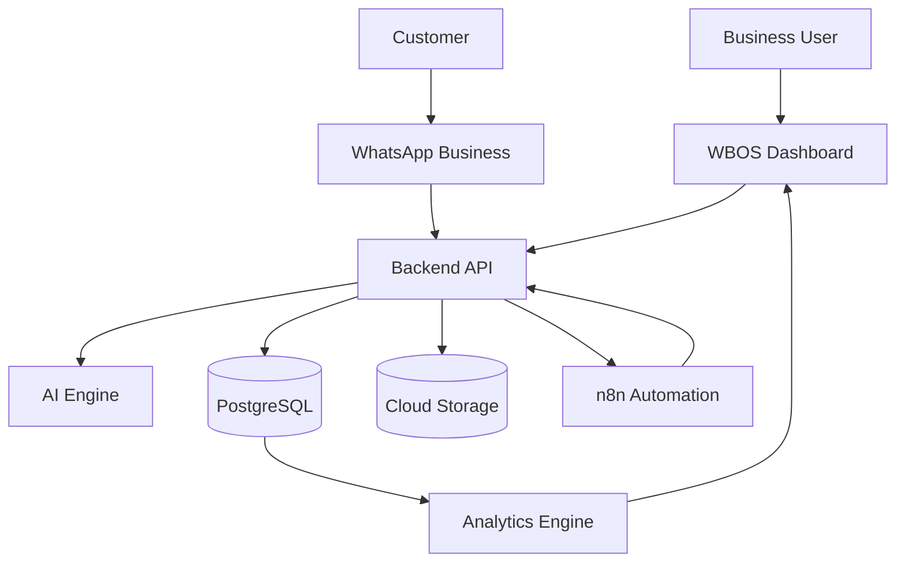
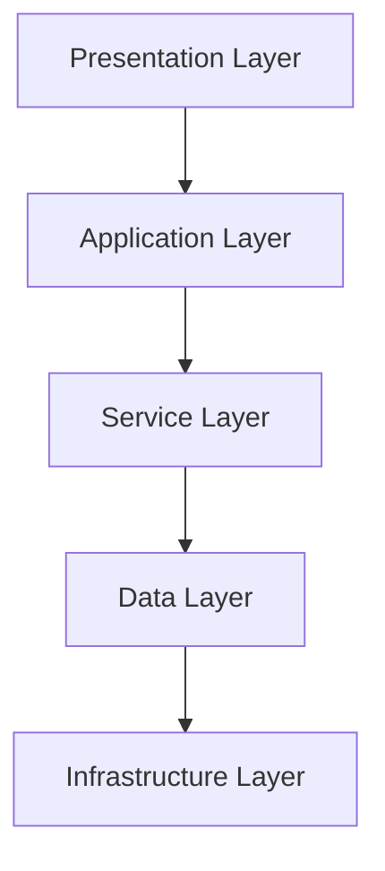
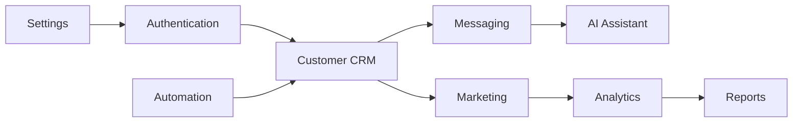
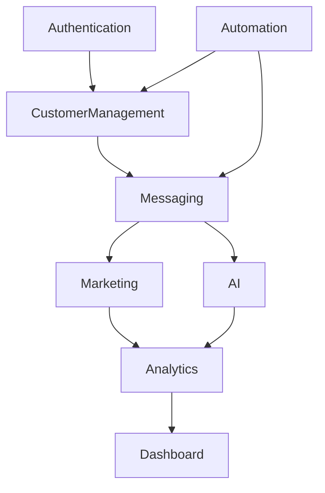
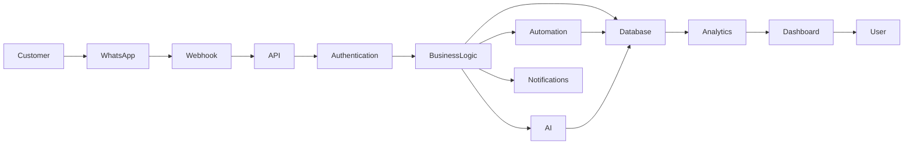
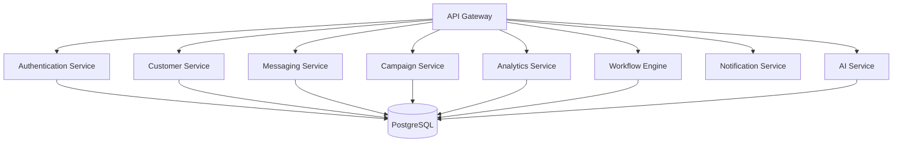
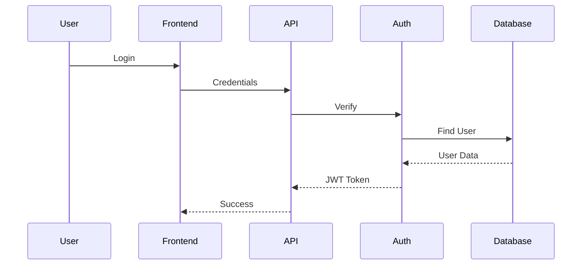
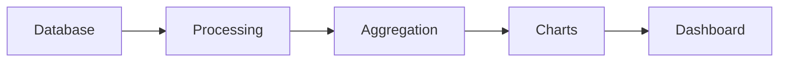
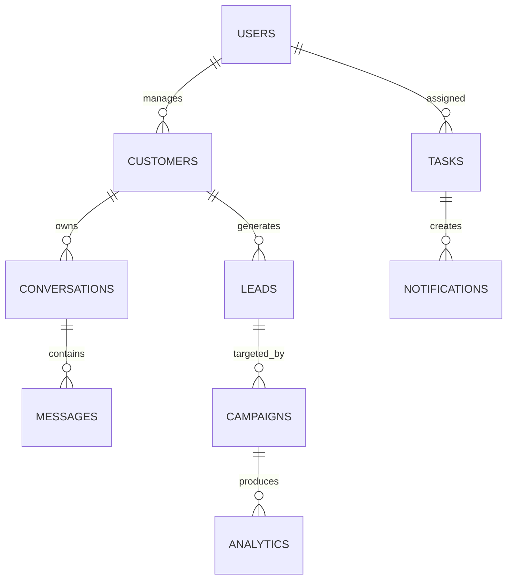

# System Architecture

## Overview

WBOS (WhatsApp Business Operating System) is designed as a modular, cloud-native platform that centralizes customer communication, business operations, artificial intelligence, workflow automation, and analytics into a single ecosystem. Instead of functioning as a traditional Customer Relationship Management (CRM) system, WBOS serves as an operational platform where multiple services work together to support business growth and improve customer engagement.

The architecture follows a layered design pattern that separates presentation, business logic, data storage, external integrations, and infrastructure. This separation improves maintainability, scalability, and security while allowing individual components to evolve independently.

---

# Architecture Goals

The primary objectives of the system architecture are:

- High availability
- Modular development
- Scalability
- Security by design
- AI-first capabilities
- Cloud-native deployment
- Easy maintenance
- Third-party integration
- Real-time communication
- Future extensibility

Every architectural decision within WBOS has been made with long-term product evolution in mind rather than only addressing current requirements.

---

# Architectural Principles

## 1. Modular Architecture

Each feature is developed as an independent module responsible for a specific business function.

Examples include:

- Authentication
- Customer Management
- Lead Management
- AI Assistant
- Marketing
- Analytics
- Workflow Automation
- Notifications

This modular approach ensures that updates to one component do not affect the rest of the system.

---

## 2. Separation of Concerns

Responsibilities are divided across multiple layers.

| Layer | Responsibility |
|---------|----------------|
| Presentation | User Interface |
| Application | Business Logic |
| Services | AI & Integrations |
| Data | Database Operations |
| Infrastructure | Deployment & Monitoring |

This improves code organization and simplifies debugging.

---

## 3. API-First Design

All major business operations are exposed through APIs.

Benefits include:

- Mobile app compatibility
- Third-party integrations
- Future microservices
- Easier testing
- Better scalability

Examples:

```
POST /customers

GET /customers

POST /messages

POST /campaigns

GET /analytics
```

---

## 4. Cloud-Native Development

WBOS is designed for deployment in modern cloud environments.

Characteristics include:

- Stateless backend
- Automatic scaling
- CDN support
- Continuous deployment
- Managed database services

---

## 5. AI-First Architecture

Artificial Intelligence is treated as a core system component rather than an optional feature.

AI services assist with:

- Customer communication
- Marketing
- Lead qualification
- Business insights
- Sales recommendations
- Conversation summaries

Future AI services can be added without modifying the core application.

---

# High-Level Architecture



The architecture consists of several independent but interconnected services.

---

# Layered Architecture



Each layer has a specific responsibility.

---

# Presentation Layer

The Presentation Layer provides the interface through which users interact with WBOS.

### Responsibilities

- Dashboard
- Customer Management
- Analytics
- Reports
- Marketing
- Settings
- Notifications
- Authentication

### Technologies

- HTML5
- CSS3
- JavaScript
- Tailwind CSS

Future versions may use:

- React
- Next.js
- TypeScript

---

# Application Layer

The Application Layer contains all business logic.

This layer receives requests from the frontend and determines how the system should respond.

Responsibilities include:

- User Authentication
- Customer Management
- Campaign Management
- Workflow Execution
- Analytics Processing
- AI Requests
- Notification Management

Example Flow

```
User clicks "Create Customer"

↓

Frontend sends API request

↓

Backend validates request

↓

Customer stored

↓

Dashboard updated

↓

Analytics refreshed
```

---

# Service Layer

The Service Layer communicates with external systems.

Services include:

## AI Service

Responsible for:

- Response generation
- Message summarization
- Customer insights
- Marketing content

---

## WhatsApp Service

Responsible for:

- Sending messages
- Receiving messages
- Media handling
- Template management

---

## Automation Service

Responsible for:

- Follow-ups
- Lead assignment
- Scheduled tasks
- Notifications

---

## Analytics Service

Responsible for:

- KPI calculation
- Dashboard generation
- Reporting
- Performance metrics

---

# Data Layer

The Data Layer stores all business information.

Primary storage includes:

- Customers
- Messages
- Products
- Leads
- Campaigns
- Reports
- Tasks
- AI Logs

The database acts as the single source of truth for all business operations.

---

# Infrastructure Layer

Infrastructure supports the deployment and operation of WBOS.

Components include:

- Vercel
- PostgreSQL
- Cloud Storage
- GitHub
- CDN
- Monitoring

Responsibilities:

- Hosting
- Scaling
- Logging
- Monitoring
- Security
- Backups

---

# Core System Components

WBOS is divided into several major modules.



---

## Authentication Module

The Authentication Module controls access to the platform.

Functions include:

- Login
- Registration
- Password Recovery
- Session Management
- Role Management
- Access Control

Supported Roles:

- Administrator
- Manager
- Sales Executive
- Marketing Team
- Support Team

---

## Customer Management Module

This module maintains customer information.

Features include:

- Customer Profiles
- Contact Information
- Tags
- Lead Status
- Purchase History
- Communication Timeline
- Notes
- Activity Tracking

This module serves as the foundation for every other feature within WBOS.

---

## Messaging Module

The Messaging Module manages customer communication.

Capabilities:

- Real-time messaging
- Media support
- Broadcast messaging
- Templates
- Message history
- Delivery status
- Read receipts
- Conversation search

---

## AI Assistant Module

The AI Assistant provides intelligent business assistance.

Capabilities include:

- Smart replies
- Conversation summaries
- Lead scoring
- Customer sentiment analysis
- Marketing content generation
- FAQ answering
- Productivity suggestions

---

## Marketing Module

This module helps businesses reach customers effectively.

Features:

- Campaign creation
- Broadcast management
- Customer segmentation
- Promotional messaging
- Campaign analytics
- Performance tracking

---

## Analytics Module

The Analytics Module transforms operational data into business intelligence.

Dashboards include:

- Customer Growth
- Sales Performance
- Lead Conversion
- Marketing Results
- Response Time
- Revenue Trends
- Team Productivity

These dashboards support data-driven decision-making.

---

# Component Relationships

The following diagram illustrates how the core modules interact.



Each module communicates through well-defined APIs, ensuring loose coupling and making the system easier to maintain and extend.

---

# Summary

The architecture of WBOS is designed around modularity, scalability, and maintainability. By separating responsibilities into distinct layers and independent modules, the platform can evolve without disrupting existing functionality. The API-first and AI-first approach ensures that future integrations—such as additional communication channels, advanced analytics, or new AI capabilities—can be incorporated with minimal architectural changes.

In the next section, **Part 2**, we will examine the internal data flow, backend services, API design, and database architecture in detail.

---

# System Architecture – Part 2

# Data Flow, Backend Services, API Layer & Database Architecture

This section explains how information travels through WBOS, how backend services interact with one another, how APIs are structured, and how data is stored, processed, and retrieved throughout the platform.

The architecture follows an event-driven, service-oriented approach that minimizes coupling between components while maximizing scalability and maintainability.

---

# Complete System Data Flow

The following diagram illustrates the end-to-end journey of a customer interaction.



Every interaction inside WBOS follows this processing pipeline.

---

# Example Workflow

Consider the following scenario.

A customer sends a message asking:

> "I would like to know the pricing."

The system performs these steps:

```
Customer

↓

WhatsApp Business API

↓

Webhook receives message

↓

Authentication verifies webhook

↓

Message stored in database

↓

Conversation updated

↓

AI generates suggested response

↓

Sales representative notified

↓

Representative reviews suggestion

↓

Message sent

↓

Analytics updated

↓

Dashboard refreshed
```

No customer interaction bypasses the centralized processing layer.

---

# Backend Service Architecture

The backend is organized into independent services.



Each service has a single responsibility.

---

# API Gateway

Every request enters the system through the API Gateway.

Responsibilities include:

- Authentication
- Authorization
- Request Validation
- Rate Limiting
- Logging
- Routing
- Error Handling

Benefits

- Centralized security
- Easier monitoring
- Cleaner architecture
- Future microservices support

---

# Authentication Service

Responsible for identity verification.

Functions

- Login

- Registration

- Password Reset

- Session Validation

- Token Generation

- Permission Verification

Authentication Flow



---

# Customer Service

The Customer Service manages all customer-related operations.

Responsibilities

- Create Customer

- Update Customer

- Delete Customer

- Search Customers

- Customer Tags

- Customer Timeline

- Purchase History

- Lead Status

The Customer Service acts as the central hub for customer information.

---

# Messaging Service

The Messaging Service handles all communication.

Features

- Receive Messages

- Send Messages

- Attachments

- Templates

- Conversation History

- Read Status

- Delivery Status

Workflow

```
Customer

↓

WhatsApp API

↓

Webhook

↓

Messaging Service

↓

Database

↓

Dashboard
```

---

# AI Service

Artificial Intelligence operates independently from the core backend.

Responsibilities

- Smart Replies

- Conversation Summary

- Sentiment Analysis

- Customer Intent Detection

- Lead Qualification

- Marketing Suggestions

- Sales Recommendations

Architecture

```mermaid
flowchart LR

Conversation --> AI

AI --> Context Engine

Context Engine --> LLM

LLM --> Response Generator

Response Generator --> Dashboard
```

Future versions may include:

- Multiple AI agents

- Vector Search

- Knowledge Base

- AI Memory

---

# Campaign Service

The Campaign Service manages promotional communication.

Capabilities

- Campaign Creation

- Broadcast Scheduling

- Audience Selection

- Delivery Tracking

- Click Analytics

- Campaign Reports

Campaign Flow

```
Create Campaign

↓

Select Audience

↓

Schedule

↓

Send

↓

Collect Analytics

↓

Dashboard
```

---

# Automation Service

Workflow automation eliminates repetitive manual tasks.

Examples

Customer registers

↓

Assign Sales Representative

↓

Create CRM Record

↓

Schedule Follow-up

↓

Send Welcome Message

↓

Notify Team

Automation reduces operational overhead while improving response times.

---

# Notification Service

Notifications keep users informed.

Notification Types

- New Lead

- New Customer

- New Order

- Failed Campaign

- AI Suggestions

- Daily Reports

- Team Updates

Supported Channels

- Dashboard

- Email

- WhatsApp

- Push Notifications

---

# Analytics Service

The Analytics Service transforms raw business data into actionable insights.

Metrics

- Customer Growth

- Revenue

- Sales

- Conversion

- Campaign Success

- Response Time

- Customer Satisfaction

- Employee Productivity

Analytics Pipeline



---

# Database Architecture

WBOS uses PostgreSQL as its primary relational database.

The database is normalized while allowing efficient reporting.

---

## Database Overview



---

# Core Tables

## Users

Stores employee information.

Fields

- User ID

- Name

- Email

- Password Hash

- Role

- Status

- Created Date

---

## Customers

Stores customer information.

Fields

- Customer ID

- Name

- Phone

- Email

- Tags

- Source

- Lead Status

- Notes

---

## Conversations

Stores every customer conversation.

Fields

- Conversation ID

- Customer ID

- Started At

- Last Activity

- Status

---

## Messages

Stores individual messages.

Fields

- Message ID

- Conversation ID

- Sender

- Timestamp

- Content

- Media

- Status

---

## Campaigns

Stores marketing campaigns.

Fields

- Campaign Name

- Audience

- Status

- Start Date

- End Date

- Performance

---

## Analytics

Stores aggregated metrics.

Examples

- Daily Revenue

- Active Users

- Customer Growth

- Conversion Rate

- Campaign ROI

---

# API Design

WBOS follows REST principles.

Base URL

```
/api/v1/
```

---

# Authentication APIs

```
POST /auth/login

POST /auth/register

POST /auth/logout

POST /auth/forgot-password
```

---

# Customer APIs

```
GET /customers

POST /customers

PUT /customers/:id

DELETE /customers/:id
```

---

# Messaging APIs

```
GET /messages

POST /messages

GET /conversations

POST /broadcast
```

---

# Campaign APIs

```
POST /campaigns

GET /campaigns

PUT /campaigns/:id

DELETE /campaigns/:id
```

---

# Analytics APIs

```
GET /analytics

GET /reports

GET /dashboard
```

---

# AI APIs

```
POST /ai/reply

POST /ai/summarize

POST /ai/sentiment

POST /ai/marketing
```

---

# Error Handling Strategy

Every API returns standardized responses.

Successful Response

```json
{
  "success": true,
  "message": "Customer created successfully",
  "data": {}
}
```

Error Response

```json
{
  "success": false,
  "error": {
    "code": 400,
    "message": "Invalid request."
  }
}
```

This consistency simplifies frontend development and debugging.

---

# Logging Strategy

Every request generates logs.

Information captured includes:

- Timestamp

- User

- Endpoint

- Request ID

- Response Time

- Status Code

- Error Details

Logging supports troubleshooting, monitoring, and auditing.

---

# Summary

Part 2 of the WBOS System Architecture describes how data flows through the platform, how backend services are organized, how APIs are structured, and how information is stored within the PostgreSQL database. The modular service-oriented design ensures that each component has a clear responsibility, enabling independent development, easier maintenance, and future scalability.

The next section, **Part 3**, will cover the Security Architecture, Deployment Topology, Scalability Strategy, Monitoring, Disaster Recovery, and the Future Evolution of the WBOS platform.
