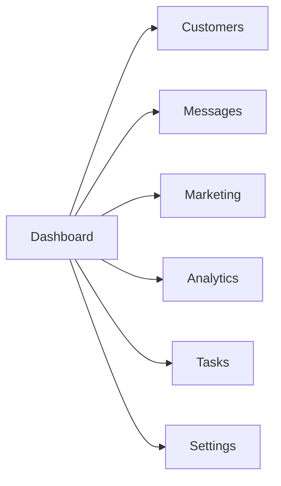
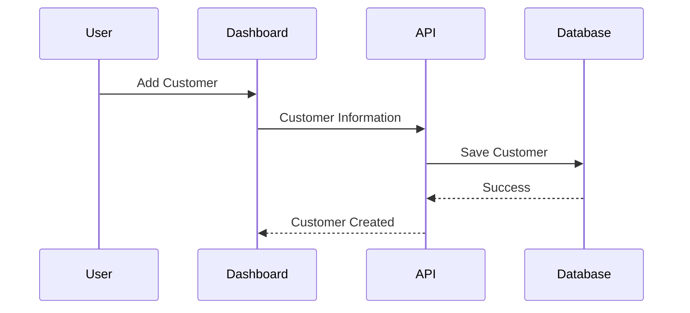
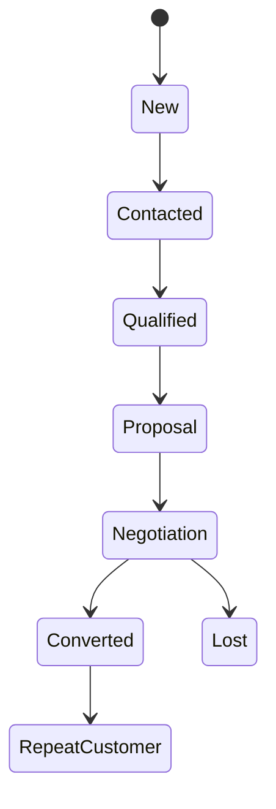
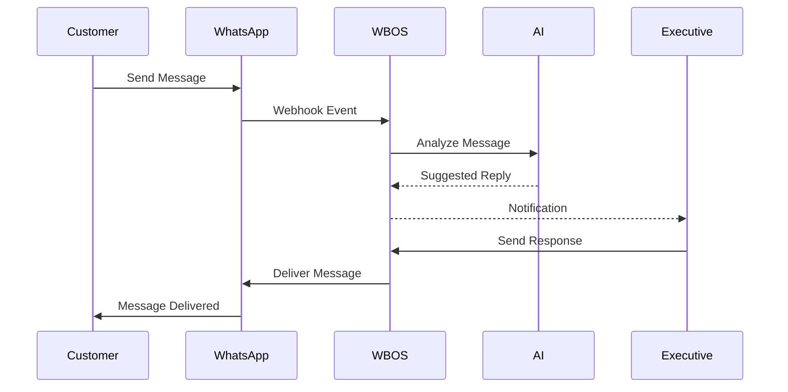
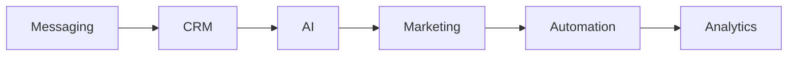
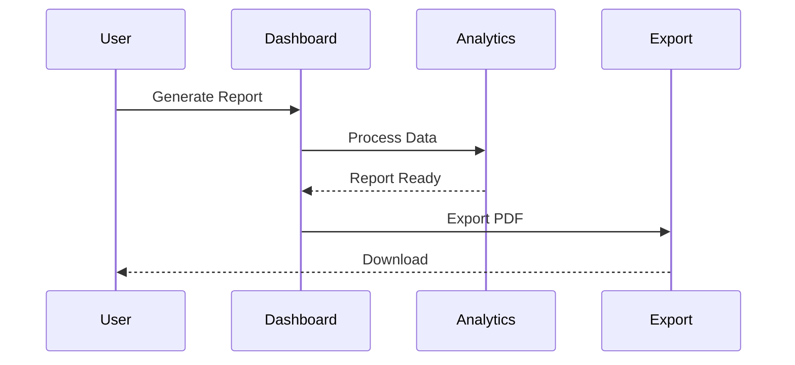

# User Workflow – Part 1

# User Roles, Authentication Flow, Dashboard Navigation & Customer Management

## Overview

The WBOS (WhatsApp Business Operating System) user workflow defines how different users interact with the platform to manage customers, communications, marketing campaigns, analytics, and business operations. The workflow has been designed with simplicity, efficiency, and scalability in mind, ensuring that every user can perform their tasks with minimal effort while maintaining secure access to business resources.

Unlike traditional CRM platforms that require users to navigate multiple disconnected modules, WBOS provides a unified workflow where customer communication, AI assistance, automation, and analytics are seamlessly integrated into a single interface.

---

# Workflow Objectives

The workflow architecture has been designed to achieve the following goals:

- Reduce the number of clicks required to perform common tasks
- Provide a consistent navigation experience
- Enable role-based access to system features
- Support real-time collaboration
- Simplify customer management
- Minimize repetitive manual work
- Improve business productivity

---

# User Roles

WBOS supports multiple user roles, each with different permissions and responsibilities.

| Role | Primary Responsibilities |
|--------|--------------------------|
| Administrator | Full system management |
| Business Owner | Business oversight and reporting |
| Sales Manager | Lead monitoring and team management |
| Sales Executive | Customer communication and lead conversion |
| Marketing Executive | Campaign management and promotions |
| Customer Support | Customer assistance and issue resolution |
| Analyst | Reports and business intelligence |

Role-Based Access Control (RBAC) ensures users can only access the features necessary for their responsibilities.

---

# Overall User Journey

```mermaid
flowchart LR

Login

-->

Dashboard

-->

Customer Module

-->

Conversation

-->

AI Assistance

-->

Task Completion

-->

Analytics

-->

Logout
```

The workflow begins with secure authentication and concludes with analytics-driven insights after business tasks are completed.

---

# Authentication Workflow

Every user must authenticate before accessing the platform.

## Login Process

```mermaid
flowchart TD

User

-->

Login Page

-->

Credential Validation

-->

Authentication Server

-->

JWT Session

-->

Dashboard
```

---

## Step-by-Step Authentication Process

### Step 1

The user visits the WBOS login page.

Required information:

- Email Address
- Password

---

### Step 2

The frontend validates the input.

Validation checks include:

- Email format
- Password length
- Required fields
- Empty values

---

### Step 3

The login request is securely sent to the backend API.

Example:

```
POST /api/v1/auth/login
```

---

### Step 4

The Authentication Service performs:

- User lookup
- Password verification
- Account status check
- Role retrieval

---

### Step 5

If authentication succeeds:

- JWT token generated
- Secure session created
- User profile loaded
- Dashboard displayed

---

### Step 6

If authentication fails:

Possible reasons:

- Incorrect password
- Invalid email
- Suspended account
- Locked account

Appropriate error messages are displayed without revealing sensitive information.

---

# Session Management

After login, WBOS manages the user's session securely.

Session includes:

- User ID
- Name
- Role
- Access Token
- Refresh Token
- Login Time
- Permissions

Session automatically expires after inactivity.

---

# Dashboard Workflow

The Dashboard serves as the primary workspace for all users.



Every module is accessible from the dashboard, allowing users to switch contexts without losing their current workflow.

---

# Dashboard Components

The dashboard includes:

## KPI Cards

Displays:

- Total Customers
- Active Leads
- Open Conversations
- Sales Performance
- Today's Messages
- Campaign Status

---

## Recent Activity

Shows:

- Latest Customers
- New Messages
- Completed Tasks
- AI Suggestions
- Notifications

---

## Quick Actions

Users can quickly:

- Add Customer
- Send Broadcast
- Create Campaign
- View Reports
- Search Customers

---

# Customer Management Workflow

Customer Management is the core of WBOS.

Every conversation, campaign, report, and AI interaction revolves around customer data.

---

## Customer Lifecycle

```mermaid
flowchart LR

New Lead

-->

Customer

-->

Active Customer

-->

Repeat Customer

-->

Loyal Customer
```

WBOS tracks customers throughout their entire relationship with the business.

---

# Creating a Customer

Workflow



---

## Customer Information

The following information may be stored:

### Personal Information

- Full Name
- Phone Number
- Email Address
- Company

---

### Business Information

- Lead Source
- Customer Category
- Assigned Executive
- Industry

---

### CRM Information

- Notes
- Tags
- Status
- Purchase History
- Last Contact Date

---

# Customer Search Workflow

Users can quickly search customers.

Supported search methods:

- Name
- Phone Number
- Email
- Tags
- Company
- Lead Status

Workflow

```
Search

↓

Matching Results

↓

Customer Profile

↓

Conversation History
```

---

# Customer Profile Workflow

Each customer has a dedicated profile page.

Profile Sections include:

## Basic Information

- Name
- Contact Details
- Customer ID

---

## Timeline

Displays:

- Calls
- Messages
- Purchases
- Notes
- Activities

---

## Lead Status

Examples:

- New
- Contacted
- Interested
- Negotiating
- Converted
- Closed

---

## Documents

Attachments include:

- Quotations
- Invoices
- Contracts
- Images

---

# Customer Timeline

```mermaid
flowchart TD

Customer Created

-->

First Message

-->

Follow-up

-->

Purchase

-->

Support Request

-->

Repeat Purchase
```

The timeline provides a chronological history of every customer interaction.

---

# Editing Customer Information

Authorized users may update customer records.

Possible updates:

- Contact Details
- Assigned Sales Representative
- Lead Status
- Tags
- Notes
- Company Information

Every modification is recorded in the audit log.

---

# Customer Tags

Tags improve organization and segmentation.

Examples include:

- VIP
- Premium
- Wholesale
- Retail
- Returning Customer
- High Priority
- Prospect
- Enterprise

Tags enable more effective filtering and marketing campaigns.

---

# Customer Assignment Workflow

Managers may assign customers to specific sales representatives.

```mermaid
flowchart LR

Manager

-->

Assign Executive

-->

Executive Dashboard

-->

Customer Queue
```

Assigned representatives receive notifications immediately.

---

# Customer Status Workflow

Each customer progresses through predefined stages.



This workflow enables accurate sales tracking and forecasting.

---

# Navigation Workflow

WBOS provides consistent navigation across all modules.

Main Navigation

```
Dashboard

↓

Customers

↓

Messages

↓

Marketing

↓

Analytics

↓

Tasks

↓

Settings
```

Breadcrumbs and navigation history allow users to return to previous pages quickly.

---

# User Experience Principles

The workflow follows several UX principles:

- Minimal clicks for common actions
- Consistent layouts
- Responsive design
- Clear visual hierarchy
- Real-time updates
- Fast search and filtering
- Accessible navigation

These principles reduce learning time and improve productivity for both new and experienced users.

---

# Summary

Part 1 of the User Workflow documentation introduced the core interaction patterns within WBOS, including user roles, secure authentication, dashboard navigation, and customer management. These workflows establish the foundation for all business operations within the platform by ensuring that users can securely access the system, manage customer information efficiently, and navigate between modules with minimal friction.

The next section, **Part 2**, will describe the workflows for **Messaging, AI Assistant, Marketing Campaigns, and Workflow Automation**, demonstrating how WBOS transforms customer interactions into intelligent, automated business processes.


---

# User Workflow – Part 2

# Messaging, AI Assistant, Marketing Campaigns & Workflow Automation

## Overview

Communication is the core functionality of WBOS (WhatsApp Business Operating System). Every interaction between a business and its customers begins with messaging. WBOS enhances this process by integrating customer relationship management, artificial intelligence, marketing automation, and workflow orchestration into a unified experience.

Rather than treating conversations as isolated events, WBOS transforms each message into structured business data that supports customer engagement, sales conversion, analytics, and long-term relationship management.

---

# Communication Workflow

The communication lifecycle begins when a customer sends a message through WhatsApp.

```mermaid
flowchart LR

Customer

-->

WhatsApp Business

-->

Webhook

-->

Messaging Service

-->

Database

-->

AI Assistant

-->

Sales Executive

-->

Customer
```

Every incoming message is securely processed, stored, analyzed, and made available to the appropriate business user.

---

# Message Reception Workflow

## Step 1

A customer sends a message through WhatsApp.

Example:

> "Hello, I would like to know more about your premium plan."

---

## Step 2

WhatsApp Business API forwards the message to the WBOS webhook.

The webhook verifies:

- Source authenticity
- Business account
- Message format
- Payload integrity

---

## Step 3

The Messaging Service receives the payload.

Operations performed include:

- Customer lookup
- Conversation lookup
- Timestamp generation
- Media detection
- Duplicate prevention

---

## Step 4

The conversation is updated.

Possible outcomes:

- Existing conversation updated
- New conversation created
- Lead automatically generated

---

## Step 5

AI analyzes the message.

Capabilities include:

- Intent Detection
- Sentiment Analysis
- Language Identification
- Suggested Reply
- Customer Classification

---

## Step 6

The assigned executive receives a notification.

The dashboard updates instantly.

---

# Conversation Workflow



---

# Conversation Management

Each conversation contains:

- Customer Information
- Conversation History
- Attachments
- Notes
- AI Suggestions
- Lead Status
- Assigned Executive
- Message Timeline

The conversation page serves as the primary workspace for customer engagement.

---

# Supported Message Types

WBOS supports various forms of communication.

### Text Messages

Customer inquiries

Support conversations

Sales discussions

---

### Images

Product photos

Invoices

Screenshots

Documents

---

### Videos

Product demonstrations

Customer submissions

Promotional content

---

### Documents

PDF

DOCX

Excel

Contracts

Invoices

---

### Audio

Voice messages

Support recordings

Customer feedback

---

# AI Assistant Workflow

Artificial Intelligence assists users throughout the communication process.

```mermaid
flowchart TD

Conversation

-->

AI Engine

-->

Intent Analysis

-->

Knowledge Processing

-->

Response Generation

-->

Executive Review

-->

Customer
```

The AI never replaces the user completely; instead, it accelerates communication and improves consistency.

---

# AI Features

## Smart Replies

The AI generates context-aware responses.

Example

Customer:

> "Can I schedule a demo?"

Suggested reply:

> "Absolutely! We'd be happy to arrange a demonstration. Please let us know your preferred date and time."

---

## Conversation Summaries

Long conversations are summarized automatically.

Example Summary

```
Customer requested pricing.

Interested in Premium Plan.

Requested follow-up tomorrow.

Sales probability: High.
```

---

## Sentiment Analysis

AI determines customer sentiment.

Possible outcomes:

- Positive

- Neutral

- Negative

- Urgent

- Frustrated

Sentiment helps prioritize customer support.

---

## Lead Qualification

AI estimates customer quality.

Lead Score Example

```
Hot Lead

92%

High purchase intent
```

---

## AI Recommendations

Examples include:

- Follow up today

- Send quotation

- Schedule meeting

- Assign senior representative

- Escalate issue

These recommendations improve sales efficiency.

---

# Marketing Campaign Workflow

Marketing campaigns are fully integrated with CRM data.

```mermaid
flowchart LR

Create Campaign

-->

Select Audience

-->

AI Optimization

-->

Schedule

-->

WhatsApp Delivery

-->

Analytics
```

---

# Campaign Creation

The user defines:

- Campaign Name
- Objective
- Audience
- Message
- Media
- Schedule

---

# Customer Segmentation

Campaign audiences may be filtered using:

- Customer Tags

- Lead Status

- Purchase History

- City

- Industry

- Last Activity

- Customer Value

This ensures campaigns reach relevant customers.

---

# AI Marketing Assistant

AI assists marketers by generating:

- Promotional Messages

- Product Descriptions

- Campaign Titles

- Call-to-Action

- Personalized Messages

Example

Input

```
Promote Premium Subscription
```

Generated Output

```
Upgrade to our Premium Plan today and unlock advanced features designed to grow your business.

Limited-time offer available now.
```

---

# Campaign Approval Workflow

```mermaid
flowchart LR

Marketing Team

-->

Manager Approval

-->

Schedule

-->

Send

-->

Performance Analysis
```

Approval ensures marketing quality and compliance.

---

# Campaign Delivery

Messages are distributed through the WhatsApp Business API.

Delivery statuses include:

- Pending

- Sending

- Delivered

- Read

- Failed

Failures are automatically logged for review.

---

# Campaign Analytics

After completion, WBOS provides metrics including:

- Total Audience

- Messages Sent

- Delivery Rate

- Read Rate

- Click Rate

- Conversion Rate

- Revenue Generated

---

# Workflow Automation

Automation reduces repetitive business operations.

```mermaid
flowchart LR

Trigger

-->

Workflow Engine

-->

Business Rules

-->

Actions

-->

Notification
```

Every automation begins with a trigger.

---

# Automation Triggers

Examples include:

- New Customer

- New Message

- Campaign Completed

- Payment Received

- Customer Inactive

- Lead Converted

- Ticket Closed

---

# Automation Actions

Examples include:

- Assign Sales Executive

- Create Task

- Send Reminder

- Notify Manager

- Update CRM

- Generate Report

- Start AI Analysis

---

# Example Workflow

Customer Registration

```mermaid
flowchart TD

Customer Registers

-->

Create Customer

-->

Assign Sales Executive

-->

Send Welcome Message

-->

Schedule Follow-up

-->

Notify Team
```

Entire workflow executes automatically.

---

# Follow-up Workflow

Customers who have not responded are automatically identified.

```
Last Reply

↓

3 Days Passed

↓

Reminder Created

↓

Executive Notified

↓

Follow-up Sent
```

This helps prevent missed opportunities.

---

# Task Management Workflow

Every automation can create tasks.

Example

```
New Lead

↓

Task Created

↓

Assigned to Executive

↓

Due Date Generated

↓

Dashboard Notification
```

Tasks remain visible until completed.

---

# Notification Workflow

Notifications keep users informed.

Notification Sources

- AI

- Campaigns

- Messages

- Tasks

- System Events

- Reports

Users receive updates through:

- Dashboard

- Email

- WhatsApp

- Push Notifications

---

# Business Process Integration

All modules operate together.



Information flows continuously between modules, eliminating duplicate data entry.

---

# Exception Handling

WBOS gracefully handles failures.

Examples

### WhatsApp API Unavailable

↓

Retry Queue

↓

Administrator Alert

---

### AI Timeout

↓

Manual Response

↓

Retry Later

---

### Campaign Failure

↓

Log Error

↓

Notify Marketing Team

↓

Retry Delivery

---

# User Experience Principles

Messaging workflows prioritize:

- Real-time communication

- Minimal manual effort

- AI assistance

- Fast response times

- Centralized customer data

- Workflow automation

These principles ensure businesses can scale communication without sacrificing customer experience.

---

# Summary

Part 2 of the User Workflow documentation explains how WBOS manages customer communication, artificial intelligence, marketing campaigns, and workflow automation. Every customer interaction is transformed into actionable business intelligence through AI analysis, CRM integration, and automated workflows. This architecture enables businesses to communicate more efficiently, automate repetitive tasks, and deliver consistent customer experiences while maintaining centralized control over operations.

The next section, **Part 3**, will cover **Analytics, Reports, Notifications, System Settings, Administrative Workflows, and the complete end-to-end user journey** across the entire WBOS platform.


---

# User Workflow – Part 3

# Analytics, Reports, Notifications, Settings & Complete End-to-End Business Workflow

## Overview

Part 3 completes the WBOS user workflow by focusing on business intelligence, reporting, notification management, system administration, and the complete customer lifecycle.

While Parts 1 and 2 covered user authentication, customer management, messaging, AI assistance, marketing campaigns, and workflow automation, this section demonstrates how WBOS transforms operational data into meaningful business insights and supports continuous business improvement.

The workflows described here ensure that businesses can monitor performance, make informed decisions, collaborate efficiently, and continuously optimize customer engagement.

---

# Analytics Workflow

Analytics transforms raw operational data into actionable business intelligence.

```mermaid
flowchart LR

Customers

-->

Messages

-->

Sales

-->

Database

-->

Analytics Engine

-->

Dashboard

-->

Business Owner
```

The Analytics Engine continuously processes customer interactions, sales activities, campaign performance, and operational metrics to generate real-time dashboards.

---

# Dashboard Workflow

After authentication, every user is redirected to a personalized dashboard.

```mermaid
flowchart TD

Login

-->

Dashboard

Dashboard --> KPI Cards

Dashboard --> Charts

Dashboard --> Notifications

Dashboard --> Tasks

Dashboard --> Reports

Dashboard --> Recent Activity
```

The dashboard provides a centralized view of all business activities.

---

# Dashboard Components

## KPI Cards

The dashboard displays key business metrics such as:

- Total Customers
- Active Leads
- Today's Conversations
- Sales Revenue
- Campaign Performance
- Open Tasks
- AI Suggestions
- Pending Follow-ups

These metrics refresh automatically as new data becomes available.

---

## Business Charts

WBOS provides interactive visualizations including:

- Customer Growth
- Revenue Trends
- Monthly Sales
- Lead Conversion
- Campaign Performance
- Team Productivity
- Customer Acquisition Sources

Charts can be filtered by:

- Date
- Employee
- Campaign
- Region
- Customer Segment

---

# Report Generation Workflow

Reports provide detailed summaries of business performance.

```mermaid
flowchart LR

Business Data

-->

Analytics Engine

-->

Generate Report

-->

PDF

Excel

Dashboard
```

Reports may be generated on demand or automatically.

---

## Available Reports

WBOS supports:

- Customer Reports
- Sales Reports
- Marketing Reports
- Lead Reports
- Employee Performance
- Campaign Analytics
- AI Usage Reports
- Financial Summaries

---

## Export Workflow



Supported formats:

- PDF
- Excel
- CSV

---

# Notification Workflow

Notifications ensure that users never miss important business events.

```mermaid
flowchart TD

System Event

-->

Notification Engine

-->

Priority Check

-->

Dashboard

Email

WhatsApp

Push Notification
```

---

## Notification Types

Examples include:

### Customer Notifications

- New Customer
- New Lead
- New Message

---

### Sales Notifications

- Lead Assigned
- Lead Converted
- Follow-up Reminder

---

### Marketing Notifications

- Campaign Scheduled
- Campaign Completed
- Campaign Failed

---

### AI Notifications

- AI Suggestion Ready
- Conversation Summary Generated
- Sentiment Alert

---

### Administrative Notifications

- New User
- Permission Changed
- Backup Completed
- System Update

---

# Task Management Workflow

Every important activity can generate a task.

```mermaid
flowchart LR

Business Event

-->

Task Created

-->

Assigned User

-->

Dashboard

-->

Completed
```

---

## Task Lifecycle

```mermaid
stateDiagram-v2

[*] --> Created

Created --> Assigned

Assigned --> InProgress

InProgress --> Completed

Completed --> Archived
```

---

## Task Information

Each task stores:

- Title
- Description
- Priority
- Due Date
- Assigned User
- Status
- Notes

---

# Settings Workflow

WBOS provides centralized configuration.

```mermaid
flowchart TD

Settings

-->

Business Settings

Settings

-->

User Settings

Settings

-->

Notifications

Settings

-->

Security

Settings

-->

Integrations
```

---

## Business Settings

Businesses can configure:

- Company Name
- Address
- Time Zone
- Currency
- Business Hours
- Branding

---

## User Settings

Users may customize:

- Profile
- Password
- Language
- Theme
- Notification Preferences
- Dashboard Layout

---

## Integration Settings

Supported integrations include:

- WhatsApp Business API
- OpenAI API
- Email Services
- Cloud Storage
- Payment Gateway (Future)

---

# Team Collaboration Workflow

WBOS supports collaborative business operations.

```mermaid
flowchart LR

Manager

-->

Assign Task

-->

Sales Executive

-->

Customer

-->

Manager Review
```

Managers can monitor team performance and redistribute workloads as necessary.

---

# Administrative Workflow

Administrators manage the overall system.

Responsibilities include:

- User Management
- Role Management
- System Configuration
- Audit Logs
- Backup Management
- API Keys
- Security Policies

---

## User Management Workflow

```mermaid
flowchart TD

Administrator

-->

Create User

-->

Assign Role

-->

Activate Account

-->

Notify User
```

---

# Customer Lifecycle

WBOS tracks customers from first contact through long-term engagement.

```mermaid
flowchart LR

Visitor

-->

Lead

-->

Qualified

-->

Proposal

-->

Customer

-->

Repeat Customer

-->

Loyal Customer
```

Each stage is automatically recorded in the CRM.

---

# End-to-End Customer Journey

```mermaid
flowchart TD

Customer Sends Message

-->

WhatsApp API

-->

Messaging Service

-->

CRM

-->

AI Analysis

-->

Executive Notification

-->

Response

-->

Customer

-->

Analytics

-->

Business Dashboard
```

This workflow demonstrates how every customer interaction contributes to business intelligence.

---

# Complete Business Workflow

```mermaid
flowchart LR

Customer

-->

Messaging

-->

CRM

-->

AI

-->

Marketing

-->

Automation

-->

Analytics

-->

Reports

-->

Management Decision
```

The workflow illustrates how operational data flows through every major component of WBOS.

---

# Exception Workflow

WBOS gracefully handles failures.

### Failed Message Delivery

```text
Message Failed
        ↓
Retry Queue
        ↓
Administrator Alert
        ↓
Retry Delivery
```

---

### AI Service Unavailable

```text
AI Timeout
      ↓
Manual Response
      ↓
Retry AI Later
```

---

### Database Failure

```text
Database Error
       ↓
Transaction Rollback
       ↓
Log Error
       ↓
Administrator Notification
```

---

# User Experience Principles

The WBOS workflow has been designed according to modern UX principles.

Key principles include:

- Minimal clicks
- Consistent navigation
- Responsive interface
- Real-time updates
- AI-assisted workflows
- Centralized information
- Automation-first approach
- Role-based access
- Fast search and filtering
- Accessibility

---

# Future Workflow Enhancements

Future versions of WBOS will introduce:

- Voice Commands
- AI Copilot
- Predictive Customer Insights
- Multi-Agent AI Collaboration
- Workflow Builder
- Drag-and-Drop Automation
- Omnichannel Communication
- Real-Time Team Collaboration
- Mobile Companion App

---

# Workflow Summary

The complete WBOS user workflow integrates customer communication, artificial intelligence, workflow automation, analytics, reporting, and administrative management into a single, cohesive platform.

Every interaction—from the moment a customer sends a message to the generation of executive reports—is captured, analyzed, and transformed into actionable business intelligence. By combining automation, AI-driven recommendations, real-time dashboards, and collaborative workflows, WBOS enables organizations to reduce manual effort, improve customer engagement, and make informed business decisions.

---

# Conclusion

The User Workflow documentation demonstrates how WBOS supports the complete operational lifecycle of a modern business. Secure authentication, intuitive navigation, intelligent messaging, marketing automation, analytics, reporting, and administrative controls work together to create an efficient and scalable business operating system.

This concludes the **User Workflow** documentation and completes the **02 – Technical** section of the WBOS project documentation.
