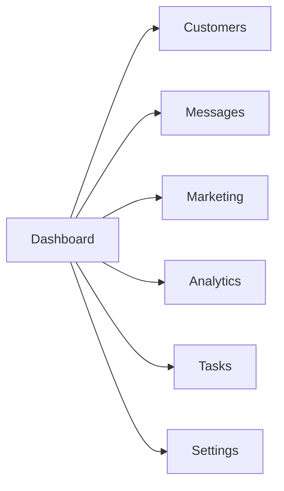
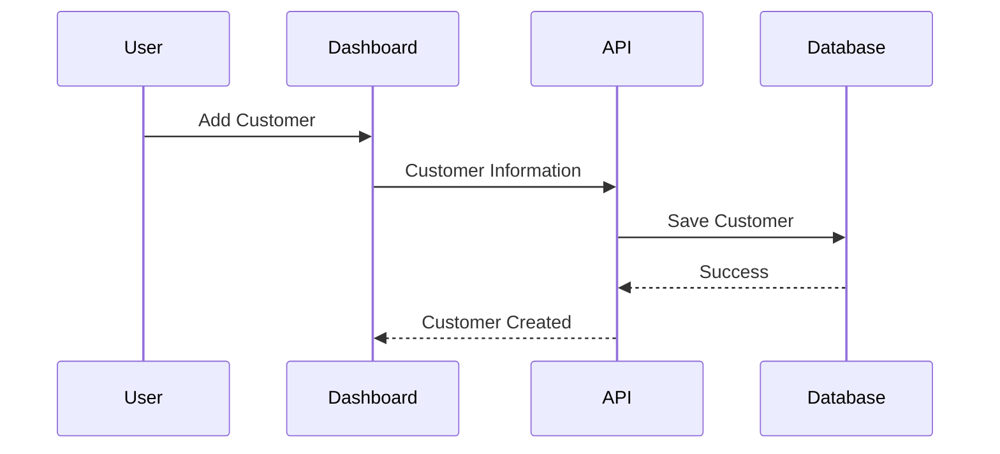
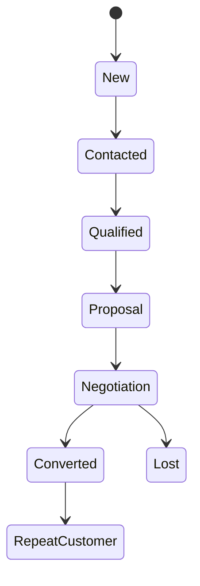

# User Workflow – Part 1

# User Roles, Authentication Flow, Dashboard Navigation & Customer Management

## Overview

The WBOS (WhatsApp Business Operating System) user workflow defines how different users interact with the platform to manage customers, communications, marketing campaigns, analytics, and business operations. The workflow has been designed with simplicity, efficiency, and scalability in mind, ensuring that every user can perform their tasks with minimal effort while maintaining secure access to business resources.

Unlike traditional CRM platforms that require users to navigate multiple disconnected modules, WBOS provides a unified workflow where customer communication, AI assistance, automation, and analytics are seamlessly integrated into a single interface.

---

# Workflow Objectives

The workflow architecture has been designed to achieve the following goals:

- Reduce the number of clicks required to perform common tasks
- Provide a consistent navigation experience
- Enable role-based access to system features
- Support real-time collaboration
- Simplify customer management
- Minimize repetitive manual work
- Improve business productivity

---

# User Roles

WBOS supports multiple user roles, each with different permissions and responsibilities.

| Role | Primary Responsibilities |
|--------|--------------------------|
| Administrator | Full system management |
| Business Owner | Business oversight and reporting |
| Sales Manager | Lead monitoring and team management |
| Sales Executive | Customer communication and lead conversion |
| Marketing Executive | Campaign management and promotions |
| Customer Support | Customer assistance and issue resolution |
| Analyst | Reports and business intelligence |

Role-Based Access Control (RBAC) ensures users can only access the features necessary for their responsibilities.

---

# Overall User Journey

```mermaid
flowchart LR

Login

-->

Dashboard

-->

Customer Module

-->

Conversation

-->

AI Assistance

-->

Task Completion

-->

Analytics

-->

Logout
```

The workflow begins with secure authentication and concludes with analytics-driven insights after business tasks are completed.

---

# Authentication Workflow

Every user must authenticate before accessing the platform.

## Login Process

```mermaid
flowchart TD

User

-->

Login Page

-->

Credential Validation

-->

Authentication Server

-->

JWT Session

-->

Dashboard
```

---

## Step-by-Step Authentication Process

### Step 1

The user visits the WBOS login page.

Required information:

- Email Address
- Password

---

### Step 2

The frontend validates the input.

Validation checks include:

- Email format
- Password length
- Required fields
- Empty values

---

### Step 3

The login request is securely sent to the backend API.

Example:

```
POST /api/v1/auth/login
```

---

### Step 4

The Authentication Service performs:

- User lookup
- Password verification
- Account status check
- Role retrieval

---

### Step 5

If authentication succeeds:

- JWT token generated
- Secure session created
- User profile loaded
- Dashboard displayed

---

### Step 6

If authentication fails:

Possible reasons:

- Incorrect password
- Invalid email
- Suspended account
- Locked account

Appropriate error messages are displayed without revealing sensitive information.

---

# Session Management

After login, WBOS manages the user's session securely.

Session includes:

- User ID
- Name
- Role
- Access Token
- Refresh Token
- Login Time
- Permissions

Session automatically expires after inactivity.

---

# Dashboard Workflow

The Dashboard serves as the primary workspace for all users.



Every module is accessible from the dashboard, allowing users to switch contexts without losing their current workflow.

---

# Dashboard Components

The dashboard includes:

## KPI Cards

Displays:

- Total Customers
- Active Leads
- Open Conversations
- Sales Performance
- Today's Messages
- Campaign Status

---

## Recent Activity

Shows:

- Latest Customers
- New Messages
- Completed Tasks
- AI Suggestions
- Notifications

---

## Quick Actions

Users can quickly:

- Add Customer
- Send Broadcast
- Create Campaign
- View Reports
- Search Customers

---

# Customer Management Workflow

Customer Management is the core of WBOS.

Every conversation, campaign, report, and AI interaction revolves around customer data.

---

## Customer Lifecycle

```mermaid
flowchart LR

New Lead

-->

Customer

-->

Active Customer

-->

Repeat Customer

-->

Loyal Customer
```

WBOS tracks customers throughout their entire relationship with the business.

---

# Creating a Customer

Workflow



---

## Customer Information

The following information may be stored:

### Personal Information

- Full Name
- Phone Number
- Email Address
- Company

---

### Business Information

- Lead Source
- Customer Category
- Assigned Executive
- Industry

---

### CRM Information

- Notes
- Tags
- Status
- Purchase History
- Last Contact Date

---

# Customer Search Workflow

Users can quickly search customers.

Supported search methods:

- Name
- Phone Number
- Email
- Tags
- Company
- Lead Status

Workflow

```
Search

↓

Matching Results

↓

Customer Profile

↓

Conversation History
```

---

# Customer Profile Workflow

Each customer has a dedicated profile page.

Profile Sections include:

## Basic Information

- Name
- Contact Details
- Customer ID

---

## Timeline

Displays:

- Calls
- Messages
- Purchases
- Notes
- Activities

---

## Lead Status

Examples:

- New
- Contacted
- Interested
- Negotiating
- Converted
- Closed

---

## Documents

Attachments include:

- Quotations
- Invoices
- Contracts
- Images

---

# Customer Timeline

```mermaid
flowchart TD

Customer Created

-->

First Message

-->

Follow-up

-->

Purchase

-->

Support Request

-->

Repeat Purchase
```

The timeline provides a chronological history of every customer interaction.

---

# Editing Customer Information

Authorized users may update customer records.

Possible updates:

- Contact Details
- Assigned Sales Representative
- Lead Status
- Tags
- Notes
- Company Information

Every modification is recorded in the audit log.

---

# Customer Tags

Tags improve organization and segmentation.

Examples include:

- VIP
- Premium
- Wholesale
- Retail
- Returning Customer
- High Priority
- Prospect
- Enterprise

Tags enable more effective filtering and marketing campaigns.

---

# Customer Assignment Workflow

Managers may assign customers to specific sales representatives.

```mermaid
flowchart LR

Manager

-->

Assign Executive

-->

Executive Dashboard

-->

Customer Queue
```

Assigned representatives receive notifications immediately.

---

# Customer Status Workflow

Each customer progresses through predefined stages.



This workflow enables accurate sales tracking and forecasting.

---

# Navigation Workflow

WBOS provides consistent navigation across all modules.

Main Navigation

```
Dashboard

↓

Customers

↓

Messages

↓

Marketing

↓

Analytics

↓

Tasks

↓

Settings
```

Breadcrumbs and navigation history allow users to return to previous pages quickly.

---

# User Experience Principles

The workflow follows several UX principles:

- Minimal clicks for common actions
- Consistent layouts
- Responsive design
- Clear visual hierarchy
- Real-time updates
- Fast search and filtering
- Accessible navigation

These principles reduce learning time and improve productivity for both new and experienced users.

---

# Summary

Part 1 of the User Workflow documentation introduced the core interaction patterns within WBOS, including user roles, secure authentication, dashboard navigation, and customer management. These workflows establish the foundation for all business operations within the platform by ensuring that users can securely access the system, manage customer information efficiently, and navigate between modules with minimal friction.

The next section, **Part 2**, will describe the workflows for **Messaging, AI Assistant, Marketing Campaigns, and Workflow Automation**, demonstrating how WBOS transforms customer interactions into intelligent, automated business processes.
